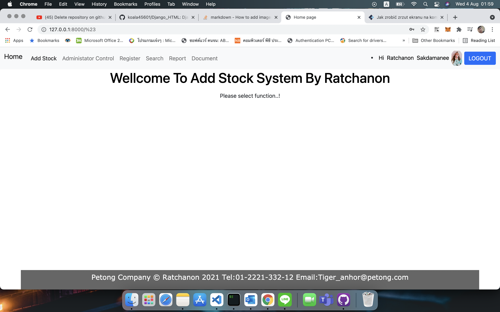

# Django_HTML
<h1> Download and install env box (pip install virtualenv) </h1>

 1. create env box and install Django 

 2. copy file in env box and ativate 

 3. go to Django path and runserver (python mange.py runserver)

 4. go to http://localhost:8000

Django +HTML + Bootstap + sqlite
